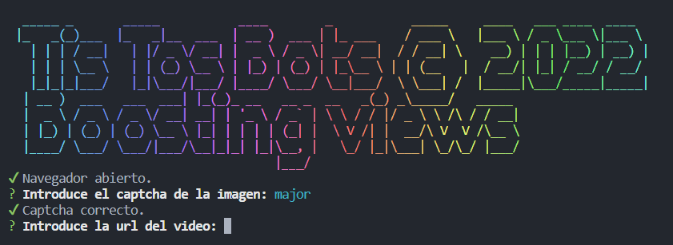

# TisTosBots

Es un proyecto de coña que hice hace un año para aprender a crear una aplicación de CLI básica en node.
Además aprendí puppeteer que me parecía bastante interesante para automatizar fácilmente tareas en el navegador.

La app te permite añadir visitas a un vídeo de tik tok.

## Ejecución

Instala node.js
Clona el repo y haz ```node index.js```.